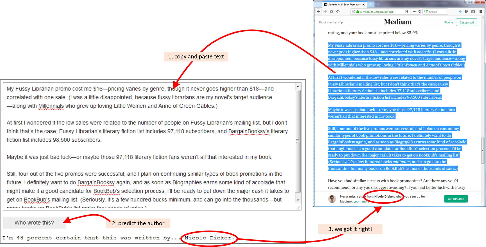

# Who Wrote This?
... or how to identify the author of anonymous articles using natural languange processing.

When writing, authors leave distinctive marks in their stories influenced by the style of their writing. Our intuition and experience as readers tells us that the style of writing is like a "finger print" that differentiates authors. If we come across a text with no information about the author or a text written under a preudonym, would we be able to tell the author based of the style of writing? An interesting article about ["Who’s At The Keyboard? Authorship Attribution in Digital Evidence Investigations"](www.utica.edu/academic/institutes/ecii/publications/articles/B49F9C4A-0362-765C-6A235CB8ABDFACFF.pdf) has been published by Carole E. Chaski. The article discusses the question to what extend text can be attributed to an author as part of crime investigations.

In this project we will explore to what extend machine learning techniques can learn the style of writing for a set of authors. A learned system would then be given a text not seen before and tries to predict who the author is.

## Getting Started

Just run `WhoWroteThis.ipynb`

The total run time for the notebook is 7.3 hours on a laptop with Intel i5-5300 CPU, 2.3GHz and 8GB RAM. The notebook requires a number of libraries. All required libraries are loaded in the first code cell. Make sure this completes without any error.

The notebook has been structured in the sequential order in which the problem has been approached. It describes the data set that has been acquired and the data cleaning activities applied. This is then followed by the main section that discusses various machine learning models. The models utilise various natural language processing (NLP) and classification algorithms. The models represent different approaches to capture the "uniqueness" of writing of the different authors. The key metric against which we measure each model is the accuracy in correctly predicting the authors for a set of articles that have not been seen before (the test data set).

Lastly, we will have some fun and use the best performing model to build a small WhoWroteThis application. The user can copy and paste any text into a text input field and ask the system to guess who the author is.
