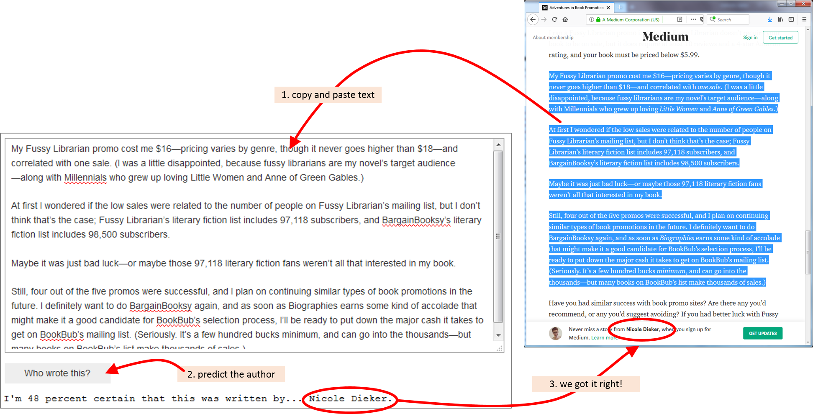

# Machine Learning Engineer Nanodegree
## Capstone Project
Stefan Dittforth  
April 4th, 2018

## I. Definition
### Project Overview

When writing, authors leave distinctive marks in their stories influenced by the style of their writing. Well know writers are famous for their techniques with which they express ideas and manipulate language. Erika Rasso published a well written introduction to [Famous Authors and Their Writing Styles](https://www.craftyourcontent.com/famous-authors-writing-styles/). We learn, for example, that Ernest Hemingway "pioneered concise, objective prose in fiction—which had, up until then, primarily been used in journalism.". Another author discussed in Rasso's article is Franz Kafka. His stories present "surrealist, nightmarish writing in contemporary settings" which invoke feelings of confusion and helplessness. Agatha Christie's style was influenced by "mentions of war". Furthermore, "she utilized a variety of poisons to carry out the murders in her stories". And being interested in archarology "resulted in ancient artifacts and archaeologists being heavily featured in her novels". A last author worthwhile to highlight here is Zora Neale Hurston. Her style is quite unique: "She wrote in colloquial Southern dialects that mimicked the language she grew up hearing.".


Photo by [Patrick Tomasso](https://unsplash.com/photos/Oaqk7qqNh_c?utm_source=unsplash&utm_medium=referral&utm_content=creditCopyText) on [Unsplash](https://unsplash.com/search/photos/text-page?utm_source=unsplash&utm_medium=referral&utm_content=creditCopyText)

Our intuition and experience as readers tells us that the style of writing is like a "finger print" that differentiates authors. If we come across a text with no information about the author or a text written under a preudonym, would we be able to tell the author based of the style of writing? An interesting article in this direction has been published by Carole E. Chaski: ["Who’s At The Keyboard? Authorship Attribution in Digital Evidence Investigations"](http://localhost:8889/notebooks/GitHub/Udacity-Capstone-Project-WhoWroteThis/www.utica.edu/academic/institutes/ecii/publications/articles/B49F9C4A-0362-765C-6A235CB8ABDFACFF.pdf) . The article discusses the question to what extend text can be attributed to an author as part of crime investigations.

### Problem Statement
In this project we will explore to what extend machine learning techniques can learn the style of writing for a set of authors. After a learning phase the system predicts which author wrote a given article. The system will not have seen the given article before. The likelihood of an article being written by a particular author will be expressed as a probability value between 0 (unlikely) and 1 (very likely).

We approach the problem with the following strategy:

1. Find a suitable data set that contains several articles from several authors. In order to have enough data to learn characteristics of individual authors we should seek a data set with a few hundred articles per author. Each article should be a few hundred words long.
2. Investigate the data to see whether data cleaning activities are required (e.g. does the text contain hypertext, header information or similar no content related information?).
3. Perform data cleaning activities if required.
4. Split the data set into training and test sets.
5. Select and train various models with different vectorization and classification algorithms with the training data set. Measure prediction accuracy of the models with the test data set.
6. Select best performing model for an application that allows a user to predict authorship of freely selected text.

Such an application can be of help, for example, for historians that try to establish authorship of text fragments. Another use case might be the analysis of how similar or dissimilar a text from one author is to other authors.

### Metrics
The problem addressed in this project represents a multi-class classification problem. For a given text the system needs to predict the most likely author of that text out of a finite list of trained authors. As we will outline in section "Data Exploration" further down, we will build our own data set. This gives us the luxury to build a well balanced data set. We will have an equal number of articles for each author. This in turn allows us to use the classification accuracy metric. Classification accuracy expresses the number of correct predictions as a ratio of all predictions made on the unseen test dataset. Accuracy will be expressed in values between 0 and 1. Whereby 1 represents the perfect result meaning the model predicts all data sets correctly.

$accuracy = \frac{true\ positives + true\ negatives}{total\ size\ of\ test\ data\ set}$

Classification accuracy is well suited for data sets with an equal (or close to equal) number of observations in each class.

An alternative to accuracy is to express the model performance as log loss (good introduction can be found [here](http://wiki.fast.ai/index.php/Log_Loss)). Log loss measures the performance of a classifier using the probabilities of the predicted labels. A perfect model would have a log loss of 0. The key difference to the accuracy is that log loss puts a penalty on incorrect classifications. This penalty is significantly higher the further away the probability of the predicted label is from the true label. Accuracy takes a "black & white" view on the predictions. A label has either been predicted correctly of not. Log loss takes into account the certainty for a prediction, expressed as probability, into account. In other words log loss is a better indicator for how confident a model is.

For our problem log loss will not be a suitable performance metric. For a given text our model will simply report the author with the highest probability as the predicted label. The probabilities for each author need to be seen relative to each other. In this scenario it is of less relevance if the probability of the predicted author is small if the probabilities of all other authors is even smaller. 

Other metrics that could be used are precision and recall. A high value for precision indicates a low rate of false positives. High recall values indicate a low rate of false negatives. Both values need to be evaluated together. A classifier performs better when high values for precision and recall are achieved. The interrelationship between precision and recall can be expressed in a single metric: the $F_1$ score. The $F_1$ score is the harmonic mean of precision and recall (more details about precision, recall and $F_1$ score see [Precision-Recall](http://scikit-learn.org/stable/auto_examples/model_selection/plot_precision_recall.html)). Precision and recall and the $F_1$ score are valuable metrics for unbalanced data sets as they provides a better consideration of false positives and false negatives. However, as mentioned above we will work with a fairly well balanced dataset and therefore use classification accuracy as our key metric.

Where appropriate we will visualize confusion matrices to get better insight into where a model does well and where it fails. The confusion matrix allows us to see where exactly the misclassifications happening.

## II. Analysis

### Data Exploration
In order to allow the system to learn the writing characteristics of different authors we require a dataset that provides a large number of articles for individual authors. There are rich datasets for NLP research available in the public domain. A list, as an example, can be found [here](https://github.com/niderhoff/nlp-datasets). However, as part of this project we will build our own dataset. We will develop a web scraper that will collect articles from the publishing platform Medium. The articles on Medium seem to be reasonably long (at least several hundred words). There are enough authors that have published several hundreds articles. With this, it appears feasible to acquire a large enough data set to learn patterns in the writing characteristics to distinguish between individual authors.

This approach has been chosen as an opportunity to develop practical experience not only in machine learning but also around data acquisition. In data science and machine learning the acquisition and preparation of high quality data is often the bigger challenge than the actual development of the machine learning system itself. In "[Datasets Over Algorithms](https://www.edge.org/response-detail/26587)" author Alexander Wissner-Gross notes that 

> *"the average elapsed time between key [machine learning] algorithm proposals and corresponding advances was about eighteen years, whereas the average elapsed time between key dataset availabilities and corresponding advances was less than three years, or about six times faster, suggesting that datasets might have been limiting factors in the advances."*.

Conveniently the website [Top Authors](https://topauthors.xyz/) has published a list of 300+ top Medium authors. The project folder contains the short script `get_list_of_Medium_authors.py` that has been used to extract the Medium URL for each author. The initial list of 300+ authors has been reduced to 25. The criteria for this reduction was the number of published articles. For the 25 authors there are at least 300 articles available. The Medium URLs for these authors can be found in file `Medium_authors_25.txt`.


The actual collection of the articles is done with the script `pull_Medium_articles.py`. The script performs two steps. First, it builds a list of all article URLs and for each article saves author URL and article URL in JSON format in the file `Medium_article_urls.json`. Below is an example how the entries for three articles look like.

```python
{"author_URL": "https://medium.com/@tedr/latest\n",
 "article_URL": "https://medium.com/season-of-the-witch/etiquette-and-the-cancer-patient-630a50047448?source=user_profile---------1----------------"}
{"author_URL": "https://medium.com/@esterbloom/latest\n",
 "article_URL": "https://medium.com/the-billfold/failing-at-shoplifting-life-with-kesha-bc2600b1f440?source=user_profile---------789----------------"}
{"author_URL": "https://medium.com/@gassee/latest",
 "article_URL": "https://mondaynote.com/the-ny-times-un-free-at-last-df2eddba360b?source=user_profile---------281----------------"}
```

The second part performs the actual download of the articles. The script reads the article URL saved in `Medium_article_urls.json`, navigates to the website and reads the text information from the html code. Each article is saved in text format in its own file. For each author a folder is generated that contains the articles for that author. Initially it was intended to store all articles in JSON format in one file. This turned out to be very cumbersome when troubleshooting the `pull_Medium_articles.py` script. Having a folder structure that allows to do quick visual inspections over the list of files in a file manager proved very helpful. In addition, the smaller article files made it easier to spot check the downloaded text information in a text editor.

|  |  |  |
| :----------------------------: | ------------------------------ | ------------------------------ |
|                                |                                |                                |

During research for this project several Python libraries for interacting with websites have been explored: [mechanize](https://pypi.python.org/pypi/mechanize/0.3.6), [BeautifulSoup](https://www.crummy.com/software/BeautifulSoup/bs4/doc/), [scrapy](https://scrapy.org/) and the [Selenium WebDriver](https://www.seleniumhq.org/projects/webdriver/). Eventually the decision was made to use the Selenium WebDriver. The key reason for this was: the Medium website uses a two step login process. The users provides its email address and then receives a one time login link via this email. That made it difficult to automate the login via script and ruled out all the libraries that don't allow user interaction with the website.

Once an article website is loaded, the required information can be pulled from the text attribute of specific html elements. The code snipped below shows the commands used to get the author name and the article text.

```python
author = self.browser.find_element_by_xpath('//a[@rel="author cc:attributionUrl"]').text
body = self.browser.find_element_by_xpath('//div[@class="postArticle-content js-postField js-notesSource js-trackedPost"]').text
```

As shown in the code snippet above the right elements are addressed by their respective xpath. Finding these xpaths required a bit of trail and error. A valuable tool for this is the FireFox Inspector. It allows to inspect the code and structure of a website and to find the right path to the right html element.


After the `pull_Medium_articles.py` script completed, the folder `Medium_articles` containing all article files has been compressed into a ZIP archive (`Medium_articles.zip`) to preserve storage. With [`zipfile`](https://docs.python.org/3/library/zipfile.html) Python provides a library to work with ZIP archives. Going forward in this Notebook we will make use of this library to work with the files directly within the ZIP archive without the need to extract the archive.

Developing a web scraper script poses its own challenges. The initial idea is pretty straightforward: here is a list of URLs, go to each website, download the text part and save it in a file. As always, the pitfalls are discovered during implementation. Some time had to be invested to understand the structure of the Medium article websites and figure out the best way to find the right html elements that contain the required information. The Selenium WebDriver is not the most effective tool when it comes to scraping several thousand websites. The time to render each and every website adds up. An attempt has been made by parallelising the article download with multi-threading and spawning of several instances of the Firefox browser. This failed. It turned out that the fast sequence of websites caused Firefox to slowly consume all available memory and eventually Firefox stopped fetching new websites. In a parallelised version of the script the problem was only exaggerated. Finally, a pragamatic approach was taken and the script has been amended with the capability to continue the work where it has left off from a previous run. Over the course of several days the script has been restarted several times and eventually saved all articles.

In defense for Selenium, it needs to be noted that Selenium first and foremost is a tool to automate testing of websites and not a tool for scaping several thousand websites. The primary goal behind the `pull_Medium_articles.py` script was to get the data for this capstone project and not to develop a sophisticated web scraper. In this respect Selenium did the job. Despite the challenges, developing the web scraper script has been a worthwhile learing experience. It provided an opportunity to develop practical experience around data acquisition.

Our web scaper has downloaded the articles in one file for each article. Each article is encoded in JSON format with four attributes: "url", "author", "headline" and "body". Below is an example for one article.

```json
{"url": "https://medium.com/the-billfold/1-is-the-loneliest-number-that-you-ll-ever-do-406f496b87c0?source=user_profile---------1193----------------",
 "author": "Ester Bloom",
 "headline": "1 is the Loneliest Number That You\u2019ll Ever Do \u2026",
 "body": "1 is the Loneliest Number That You\u2019ll Ever Do \u2026\nThursday is a great day to do that 1 thing you don\u2019t want to do but also don\u2019t want to continue thinking about doing.\nThe thing I really should do is go to my stupid health insurance webpage and find a stupid doctor to take care of a small but annoying problem. It\u2019s the kind of problem that surfaced LAST YEAR just before my family\u2019s 7-week Great Escape and I waited for it to go away on its own as we made our way through two or three different countries, until I finally limped into a Spanish hospital and begged for help. A punctual, kind, and handsome, though sadly not very English-speaking, doctor gave me a temporary fix, and then said I\u2019d need to get real attention once I returned to the States.\nOf course, I didn\u2019t. Now that it\u2019s summer again the problem is getting harder to ignore. I hate bureaucracy and the thought of maybe having to have surgery (!) and not being able to walk (!!) so I just keep putting it off. But. Today I will change all that. Today I will find and call a doctor. Today I will DO 1 THING.\nHow about you?"}
```

All articles have been downloaded in individual text files and into folders for each author. This folder and file structure has been archived into `Medium_articles.zip`. For an an overview about the data set the table below list the number of articles for each author.

| author            | number of articles |
| ----------------- | ------------------ |
| Nicole Dieker     | 1948               |
| Fabricio Teixeira | 1733               |
| Ester Bloom       | 1328               |
| Ethan Siegel      | 1323               |
| Yann Girard       | 1042               |
| Pascal Finette    | 1020               |
| Jon Westenberg 🌈  | 932                |
| Chris Messina     | 872                |
| Mark Suster       | 825                |
| howardlindzon     | 795                |
| umair haque       | 688                |
| James Altucher    | 680                |
| Johnson Kee       | 660                |
| Larry Kim         | 619                |
| Sean Everett      | 558                |
| Tim Boucher       | 451                |
| M.G. Siegler      | 377                |
| Nir Eyal          | 366                |
| Srinivas Rao      | 355                |
| Brad Feld         | 350                |
| Todd Brison       | 340                |
| Thaddeus Howze    | 339                |
| Jean-Louis Gassée | 337                |
| Ted Rheingold     | 319                |
| Gary Vaynerchuk   | 307                |

The number of articles per authors in the data set is skewed. The number of articles ranges from 1,948 for Nicole Dieker to 307 for Gary Vaynerchuk. To avoid that our system develops a bias towards authors with a high number of articles we will balance the data set. This will be done by keeping the number of articles for each author equal to the author with the lowest number of articles.

Going forward we will work with 307 articles for each author.

### Exploratory Visualization

To get some first insight into the data set we will plot a histogram for each author that shows the distribution of article lengths.


From the chart above we can already see differences between the various authors. We see, for example, Yann Girard and Chris Messina have a preference for shorter articles (less then 250 words) whereas the majority of articles of Ethan Siegel and Thaddeus Howze has a length between 1,000 and 2,000 words.

### Algorithms and Techniques

We will implement the following models that will utilize various combinations of algorithms for vectorizing the raw text and then learning the classifications. The models represent different approaches to capture the "uniqueness" of writing of the different authors.

- **Model 1 Baseline Model - Just Guess the Author:** This will be our benchmark (or baseline) model. See discussion in section Benchmark.

- **Model 2 Basic Article Metrics:** We will come up with some simple metrics as features that might help us to predict the author of an article. The metrics that come to mind are: the total, mean, median, min and max number of words in paragraphs, sentences and the article itself. When looking at different authors it appears that these features might be useful differentiators. Some authors have a tendency to longer articles. Others use longer sentences or shorter paragraphs. We will test prediction accuracy when learning with decision tree and the logistic regression classifier.

- **Model 3 Bag-of-Words - Word Count:** In this model we will use the vocabulary to build our prediction model. We will implement a the Bag-of-Words algorithm. Bag-of-Words is a very simple but often surprisingly effective algorithm. It takes all the different words in a training set and uses them as features. Each article is then transformed into a feature vector by marking the occurrence of each feature (=word). There are a few variations of Bag-of-Words. In it's basic form each vector counts the number of occurrences for each word. This is what we are going to use in this model 3. The vectorized text will be used to train three classifiers: decision tree, logistic regression and support vector machines (SVM).

- **Model 4 Bag-of-Words - TFIDF:** A model that utilizes the term frequency–inverse document frequency (TFIDF) approach. In TFIDF, similar to word count, each word represents a feature. Each word is assigned a weight factor that is higher the more often a word occurs in an article. However, at the same time the weight of a word is reduced the more often it occurs across other articles. The idea behind TFIDF is that words that occur more across multiple articles carry less meaning then specialized words that occur within a smaller number of articles. The vectorized text will be used to train three classifiers: decision tree, logistic regression and support vector machines (SVM).

- **Model 5 Bag-of-Words - Reduced Vocabulary:** Using the Bag-of-Words algorithm usually results in very large feature vectors. Large feature vectors require more time during the learning phase. In this model we will investigate to what degree a reduced vocabulary impacts our prediction accuracy. We only keep words in the vocabulary that occur at a minimum rate. The vectorized text will be used to train three classifiers: decision tree, logistic regression and support vector machines (SVM).

- **Model 6 Bag-of-Words - Bigrams:** The previous models 3 - 5 only utilized the frequency or count of individual words. These approaches do not try to represent any form of "meaning" in the text. Would our prediction accuracy increase if we find a way to represent relationships between words? One popular way to represent word relationships in NLP are bigrams (or more generalized n-grams). Bigrams count the occurrence of word pairs. The hypothesis is that certain word combinations used by individual authors in their writings will provide a strong indication of authorship. The vectorized text will be used to train three classifiers: decision tree, logistic regression and support vector machines (SVM).

- **Model 7 Bag-of-Words - Reduced Bigrams:** This will be a variation of model 6. The use of bigrams during vectorization creates significantly large feature vectors. This is a problem as it demands a significantly larger volume of training data for the classifier to learn something meaningful. In this model we will investigate the impact of reducing the length of the feature vector by only keeping bigrams with a minimum number of occurrences. The vectorized text will be used to train three classifiers: decision tree, logistic regression and support vector machines (SVM).

- **Model 8 Learn Word Embeddings & CNN:** Another approach to numerically represent meaning in text is offered by using word embeddings. Word embedding algorithms such as Word2Vec and GloVe aim to find similar representations for words with similar meanings. Individual words are represented by vectors with tens or several hundred dimensions. These vectors are learned by processing a large amount of text through a neural network. During learning, the algorithm learns the embedding either by predicting the current word based on its context or by predicting the surrounding words given a current word. The result of the embeddings learning phase is a set of vectors where words with similar meanings have similar vectors. Essentially "similarness" is represented by the distance between word vectors. The vector representations of words with similar meanings have shorter distances between them.

  In recent years word embedding approaches have been one of the key breakthroughs in natural language processing.

  Based on this promising outlook we will test the word embeddings approach on our problem. Model 8 will learn word embeddings as part of the convolutional neural network (CNN).

- **Model 9 GloVe Word Embeddings & CNN:** In this model we will utilize pre-trained word embeddings from the [GloVe algorithm](https://nlp.stanford.edu/projects/glove/). This is done based on the hypothesis that the GloVe word embeddings will provide much more accurate representations of word relationships than what we can train with our limited training data set.


http://www.wildml.com/2015/11/understanding-convolutional-neural-networks-for-nlp/

Convolutions and pooling operations lose information about the local order of words

The approach in these papers seems to work well for long-form texts 
(like movie reviews), but their performance on short texts (like tweets)
 isn’t clear.

CNN

For models 8 & 9 we will utilize a convolutional neural network (CNN) to train the model to differentiate between authors. In recent years CNNs were behind many breakthroughs in computer vision. The main reason for these successes is the pattern learning capability of CNNs. CNNs consist of an input layer followed by multiple convolution, pooling and fully connected layers. As the training data flows through the CNN the different layers learn different pattern. In general the complexity of learned patterns increases with each layer in the CNN. In image recognition the first convolutional layer usually learns edges. Subsequent layers learn shapes made out of edges and deeper layers learn to recognize more complex objects from basic shapes.

For our project the hypothesis is that the pattern recognition capability of CNN's will also be applicable to our NLP problem. Our CNN will learn differences between authors that manifest themselves in the patterns of occurrences of individual words and words combinations.

To use a CNN for a NLP problem it is required to transform the text in articles into a numerical matrix representation. In our models 8 & 9 each row in the matrix will represent a word. Words are represented as word embeddings vectors. Word embeddings are vectors with tens or several hundred dimensions. These vectors are learned by processing a large amount of text through a neural network. During learning, the algorithm learns the embedding either by predicting the current word based on its context or by predicting the surrounding words given a current word. The result of the embeddings learning phase is a set of vectors where words with similar meanings have similar vectors. Essentially "similarness" is represented by the distance between word vectors. The vector representations of words with similar meanings have shorter distances between them. The image below depicts the text "all models are equal some are useful" transformed into a word embeddings representation using the pre-trained GloVe vectors.


The pre-trained [GloVe vectors](https://nlp.stanford.edu/projects/glove/) are available as 50, 100, 200 and 300 dimensional word vectors. For our model 9 we will use the 300 dimension version.

When configuring a CNN's we are requires to specify the dimensions of the input layer. Once defined these dimension will be fixed throughout the lifetime of the CNN. This requires the input data to be normalized to the dimensions of the input layer. In computer vision, if the training images are of varying dimensions, this proves less of an issue. Images can be resized to the required dimensions of the input layer and will still preserve key information in the images. In our case, where the input data are articles of varying length, the fixed dimensions of the input layer poses a problem. Unfortunately there is no equivalent to "image resizing" for text.

One approach to address this would be to arbitrarily define a maximum length for articles. All words beyond that length are discarded. This obviously has the disadvantage that key information for learning an author's style of writing is lost with the discarded portion. A second approach might be to split articles into fixed length "sub-articles". These sub-articles then replace the original long article in the data set. The advantage of this approach is that information is not lost. However, a side effect is that this might skew the training data set. As outlined in the Data Exploration section above we deliberately prepared the data set so that there is an equal number of articles for each author to avoid that our model develops a bias towards authors with a high number of articles. If we are now splitting long articles into smaller sub-articles we might reintroduce the imbalance. The last approach, which we will use in our CNN models, is to use the length of the longest article in the training data set as the number of rows for the input layer. This ensures all training article will fit into the embeddings layer.

The image below visualizes the complete CNN architecture used in our CNN models. The CNN architecture is based on the CNN model with embedding layer shown in "Deep Learning for Natural Language Processing, Develop Deep Learning Models for Natural Language in Python" by Jason Brownlee, page 163. The model has been modified to a multiclass classifier (original model was a binary classifier for sentiment analysis).


The flatten layer takes the ... x ... matrix output generated by the max pooling layer and converts it into a vector for the multi layer perceptron (MLP) that comes next. The relu function will set all negative values to zero. This helps with the vanishing gradient problem. With the relu activation function the model will attain a much better accuracy. Dropout layers help to address over fitting of the model by removing some of the nodes during training. As we deal with a classification problem we will specify categorical cross entropy as our loss function for the model. A higher number of filters allows the model to learn more patterns in the data set. If we need to discover more patterns we need more filters. A large number of filters mans that the dimensionality of the convolutional layer gets large. Higher dimensionality leads to a higher number of parameters which can lead to over fitting. The pooling layer helps to reduce the dimensionality of the convolutional layer. The pooling layer reduces the width and height of the feature map. 


The first layer will be an embeddings layer with 300 columns, representing the 300 dimensions of the word vectors. The number of rows will be determined by the length of the longest article in the training data set.

```python
model = Sequential()
model.add(embedding)
model.add(Conv1D(filters=32, kernel_size=8, activation='relu'))
model.add(MaxPooling1D(pool_size=2))
model.add(Flatten())
model.add(Dense(10, activation='relu'))
model.add(Dense(25, activation='softmax'))
model.compile(optimizer='adam', loss='sparse_categorical_crossentropy', metrics=['acc'])
model.summary()

_________________________________________________________________
Layer (type)                 Output Shape              Param #   
=================================================================
embedding_1 (Embedding)      (None, 12580, 100)        7629000   
_________________________________________________________________
conv1d_1 (Conv1D)            (None, 12573, 32)         25632     
_________________________________________________________________
max_pooling1d_1 (MaxPooling1 (None, 6286, 32)          0         
_________________________________________________________________
flatten_1 (Flatten)          (None, 201152)            0         
_________________________________________________________________
dense_1 (Dense)              (None, 10)                2011530   
_________________________________________________________________
dense_2 (Dense)              (None, 25)                275       
=================================================================
Total params: 9,666,437
Trainable params: 9,666,437
Non-trainable params: 0
```


### Benchmark
To assess the quality of the predictions of the models described above we will need to compare against some baseline. In our case we will simply do a random guess of who the author of an article is. This should get us in the order of $\frac{1}{n}\cdot100$ percent accuracy, where $n$ represents the number of authors in the dataset.

```
Just guess the author:
----------------------

number of authors in data set: 25
expected prediction accuracy around: 4.00%
prediction accuracy score on data set: 3.77%
```

## III. Methodology

### Data Preprocessing
The articles were downloaded by extracting the 'text' attribute from html elements that contain the body text of the article.  Many articles contain images, URLs to other pages, etc. There is the concern that the text extracts still contain html fragments which might need to clean out. Utilizing Python code all articles have been searched for the occurrence of the '<' and '>' characters. Those two characters enclose HTML tags. It was found that There are only 156 occurrences for the '<' and '>' characters in over 18,500 articles. Doing some spot checks it appears that the tag brackets are genuine parts of the article text (for example the text is about HTML coding). Based on this it has been decided to leave the html code fragments in the text corpus and not to clean them out.

### Implementation
The project has been implemented in the form of the Jupyter notebook `WhoWroteThis.ipynb`. The notebook is extensively documented throughout. Actually, this project report is an extract from the discussions presented in the Jupyter notebook.

The `WhoWroteThis.ipynb` notebook has been structured in the sequential order in which the problem has been approached. The first few sections describe the data set that has been acquired and the data cleaning activities applied. This is then followed by the main section that discusses various machine learning models. The models utilize various natural language processing (NLP) and classification algorithms (see also section "Algorithms and Techniques" above).

### Refinement
The original plan for this project was to first test different algorithms in a series of models and then refine the most promising model. The models chosen represent an increase in complexity. This was done under the hypothesis that more complex models are more capable to capture "uniqueness" of writing of the different authors.

However, it was found that model 3 utilizing word count for text vectorization and a logistic classifier performed surprisingly well. The prediction accuracy against the test data set for this model was 92.55%. All other models performed way below this performance mark. A visualization of the performance of the individual models and a detailed discussion can be found in the conclusion section.

## IV. Results
### Model Evaluation and Validation

The successful model in this project is model 3. This model utilized the Bag-of-Words algorithm with a word count vectorizer. For each word in an article the number of occurrences is counted. Three classification algorithms have been tested: logistic regression, decision tree and SVM. The logistic regression classifier was the best performing classifier with a prediction accuracy of 92.55% on the test data set.

```
training the model

number of training articles: 5,756
size of the vocabulary = length of the feature vector: 63,021

scoring the training data:

logistic regression classifier prediction accuracy score : 100.00%
decision tree classifier prediction accuracy score : 100.00%
SVM classifier prediction accuracy score : 33.10%

scoring the test data:

logistic regression classifier prediction accuracy score : 92.55%
decision tree classifier prediction accuracy score : 76.76%
SVM classifier prediction accuracy score : 29.55%
```

The model has been used in a small application at the end of the notebook to demonstrate a possible real world application use case. The user can copy an article (or a part of an article) in a text field and let the model predict who the author is.



### Justification

The prediction capability of model 3 with logistic regression classifier performed significantly better then the benchmark model. Model 3 achieved a prediction accuracy of 92.55% vs. the 3.77% by the benchmark model. The benchmark model performs just a random guess of who the author of an article is.

## V. Conclusion
### Free-Form Visualization
The chart below summarizes the test data prediction accuracy of the various models we have have investigated in this project.


It is interesting to see that the good old logistic regression classifier in model 3 has achieved a prediction accuracy of 92.55%. With that it has significantly outperformed all other classification approaches. This is a good reminder that, even with todays state of the art algorithms, it's always worth to look into simpler algorithms.

The reason why the more sophisticated models 8 & 9 with word embeddings and CNNs didn't perform better, is probably because of the small size of training data available. Word embeddings require large volumes of training data to pick up the relationship between individual words. For the problem addressed in this project, predicting the authorship of a given text, the amount of training data will always be very limited. As shown in section [Exploring the Data Set](http://localhost:8889/notebooks/GitHub/Udacity-Capstone-Project-WhoWroteThis/WhoWroteThis.ipynb#Exploring the Data Set) the most active authors have produced a few hundred articles. Only six have produced 1,000 and more articles. If an application needs to be developed that needs to classify articles into topic categories (sport, gardening , science, ....) then the amount of training data will definitely be much higher as much more authors will write about the same topic. This would make the word embeddings approach worthwhile to revisit. 

It is worthwhile to note that model 2 achieved a prediction accuracy above 30%. This model was build only on features reflecting the number of words in articles, paragraphs and sentences. The model does not take anything of the article content into account. In future improvements this model might be used as part of an ensemble learner to improve the prediction accuracy.

### Reflection
As mentioned in the previous section it was interesting to see that a model with a simple logistic classifier performed significantly better that more complex models.

Throughout the development of this project some effort has been put into refactoring the code with re-usability in mind. Jupyter notebooks are a great tool for testing approaches and algorithms. Once a promising model has been identified, it is expected that a notebook like this will be handed over to an implementation developer who will transform the code into something that can be shipped to production. Models 3 - 9 have been implemented as Python classes with a consistent interface providing `train`, `predict` and `score` methods. Pre-processing activities have been "packaged" into separate functions which supports reuse and, hopefully, code readability. It is believed that instilling a "production usable" mindset in machine learning engineers will benefit the quick transition of new ideas into usable applications. The last section in the `WhoWroteThis.ipynb` notebook demonstrates the simplicity with which the successful model 3 can be used in a simple application.

An important learning from this project is to keep an eye on testing the different stages of the machine learning pipeline. For all of the models discussed above the raw text from the articles had to be transformed in several stages in order to be used with a classifier or a neural network. The initial text cleaning tasks (removal of punctuation and stop words, stemming, transform all words to lowercase) are fairly straightforward and can be validated by a simple visual inspection of a few samples. It gets a bit more tricky when text is transformed into numbers such as word counts or, even more so, integers that act as pointers to word vectors. Are the numbers I now see are integer indexes or still the word counts from the model I tried earlier? Am I sure that each word/token has now been encoded with its unique integer value? The challenge with machine learning implementation is that bugs not necessarily manifest themselves in hard stops of the code. How do you know whether the reported prediction accuracy of X% is because of the limits of the model or because of a bug in your vectorization code? To address this it is worthwhile for machine learning engineers to be mindful about testability of the different stages of a machine learning system.

### Improvement
Model 3 already achieved a remarkable prediction accuracy of 92.55% and increasing this even further might be difficult. Future projects that might want to look into different approaches for vectorization and classification. One approach might be the use of ensemble learning. This approach would require to come up with a series of weak learners that have low individual prediction accuracy but combined might be able to increase the overall prediction accuracy.

### Sources

A very helpful resource for this project was the book *"Deep Learning for Natural Language Processing, Develop Deep Learning Models for Natural Language in Python"* from Jason Brownlee. From this book  (page 163) the CNN used in models 8 & 9 has been taken. The CNN has been modified to a multiclass classifier (original model was a binary classifier for sentiment analysis).

The following sources served as inspiration for this project and provided valuable guidance for implementing NLP systems.

1 [Famous Authors and Their Writing Styles](https://www.craftyourcontent.com/famous-authors-writing-styles/)

2 ["Who’s At The Keyboard? Authorship Attribution in Digital Evidence Investigations"](http://www.utica.edu/academic/institutes/ecii/publications/articles/B49F9C4A-0362-765C-6A235CB8ABDFACFF.pdf)

3 ["How a Computer Program Helped Show J.K. Rowling write A Cuckoo’s Calling"](https://www.scientificamerican.com/article/how-a-computer-program-helped-show-jk-rowling-write-a-cuckoos-calling/)

4 [How to solve 90% of NLP problems: a step-by-step guide](https://blog.insightdatascience.com/how-to-solve-90-of-nlp-problems-a-step-by-step-guide-fda605278e4e)

5 [scikit learn documentation: confusion matrix](http://scikit-learn.org/stable/auto_examples/model_selection/plot_confusion_matrix.html#sphx-glr-auto-examples-model-selection-plot-confusion-matrix-py)

6 [Deep Learning for Natural Language Processing, Develop Deep Learning Models for your Natural Language Problems](https://machinelearningmastery.com/deep-learning-for-nlp/)

7 [Deep Learning for NLP Best Practices](http://ruder.io/deep-learning-nlp-best-practices/index.html#wordembeddings)

8 [Multi-Class Classification Tutorial with the Keras Deep Learning Library](https://machinelearningmastery.com/multi-class-classification-tutorial-keras-deep-learning-library/)

